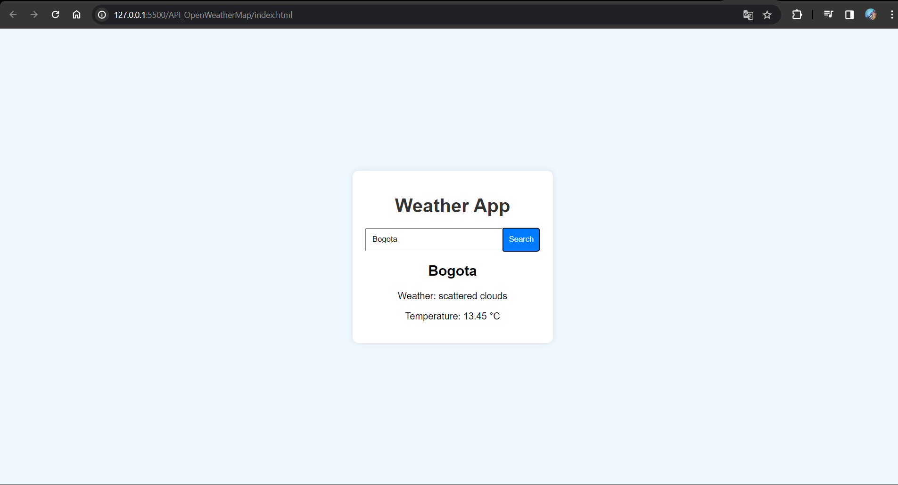

# OpenWeatherMap API 🌤️

Este proyecto es una aplicación web que permite consultar el clima actual de cualquier ciudad utilizando la API de [OpenWeatherMap](https://openweathermap.org/). Fue desarrollada con JavaScript Vanilla, Html y Css.

---

## 🚀 Características
- Consulta el clima actual por ciudad
- Muestra mensajes de error si la ciudad no se encuentra o hay problemas de conexión.

